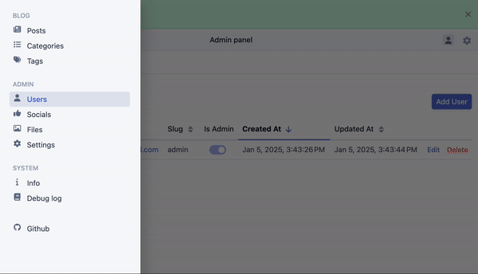
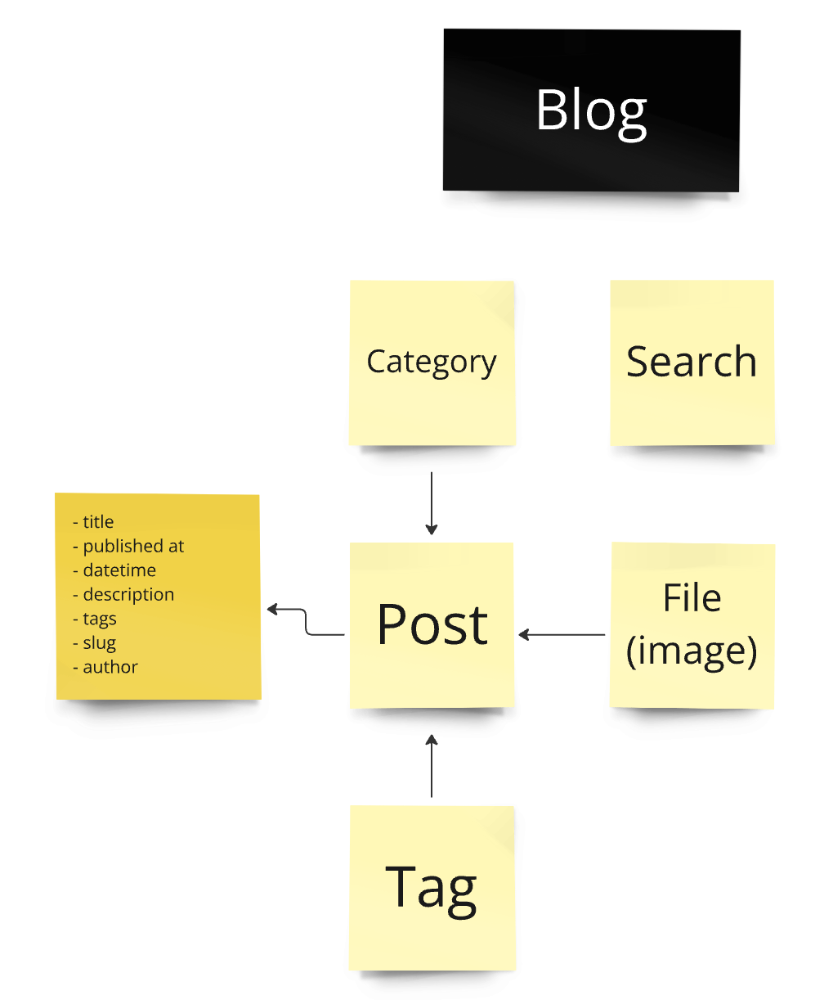
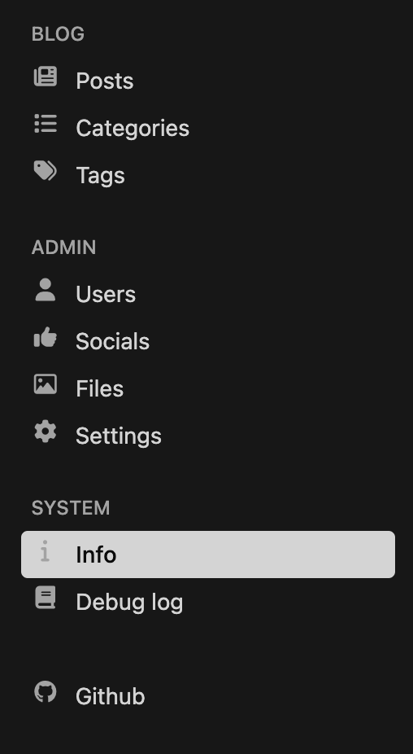
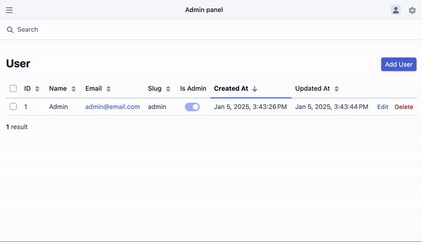

# Simple Blog
## Overview

The Blog Application offers a simple, user-friendly admin panel and API for managing blog resources. It provides a seamless experience for administrators and editors to create and maintain blog content.

# [Getting started](docs/getting-started.md)

---

## Key Features

- **Technologies**: Built with PHP and the [Symfony Framework](https://symfony.com), backed by a PostgreSQL database with Doctrine ORM.
- **Documentation**: API documentation available via [Swagger](https://swagger.io).
- **Development Setup**: Pre-configured [Docker Compose](https://docs.docker.com/compose/) with [FrankenPHP](https://frankenphp.dev) for quick local development.
- **Core Features**:
    - Manage **Posts**, **Categories**, **Tags**, and **Images**.
    - User roles:
        - **Admin**: Full system access.
        - **Editor**: Limited access (manage blog content but cannot manage users or view system logs).
- **UI Modes**: Light and dark mode options for the admin panel (thanks to [EasyAdminBundle](https://github.com/EasyCorp/EasyAdminBundle)).
- **Architecture**: Dependency Injection & CQRS patterns for a clean and maintainable codebase.

---

## Resources in the System

### 1. **Posts**
Manage individual blog posts with titles, content, and associated categories, tags, and images.

### 2. **Categories**
Organize blog posts into categories for easy navigation.

### 3. **Tags**
Assign tags to posts for better categorization and searchability.

### 4. **Files**
Upload and manage images for use in posts and other resources.

### 5. **Socials**
Manage links to your social media pages. Keep your social profiles up to date and accessible from the blog.

### 6. **Settings**
Define and manage custom system settings to tailor the application to your needs.

---

## User Roles

### 1. **Admin**
Admins have full access to the system:
- Manage all blog resources.
- Manage users.
- View system info and debug log.

### 2. **Editor**
Editors have restricted access:
- Manage blog posts, categories, tags, and images.
- Cannot manage users or view system debug logs.

*Admin panel is available in Light and Dark mode!*

---
