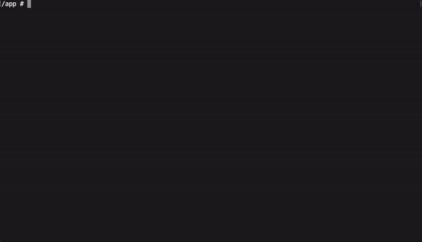
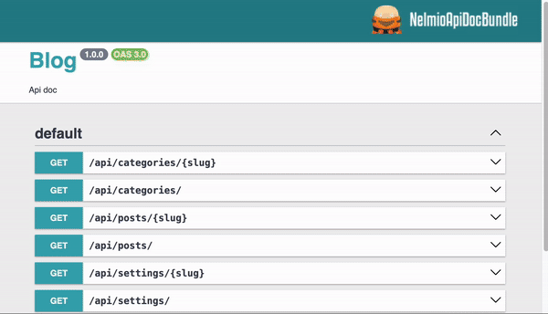

## Getting Started

### 1. **Setup Development Environment**
Make sure you have [Docker](https://www.docker.com/products/docker-desktop/) installed. Clone the repository and run:

```bash
make setup
```
... then:
```bash
make start
make migrate
```
This will set up the application and its dependencies for local development.

### 2. **Access the Admin Panel**



Open console in docker container:
```bash
docker compose exec php sh
```

Create first user in the system:
```bash
bin/console app:create-admin <name> <email>
```

Now Admin account should be created and random password should be displayed in the console output.
Navigate to https://localhost/admin in your browser. Use Admin e-mail and password from the output to login.

### 3. **Swagger API Docs**



Visit https://localhost/api/doc to explore the available API endpoints.

### 4. **Checking tools**

If you want to run static analysis and integration tests like on a pipeline:

```bash
make check
```

---
